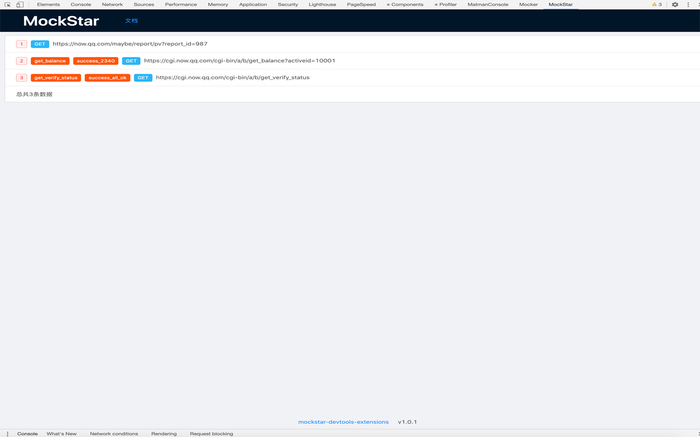
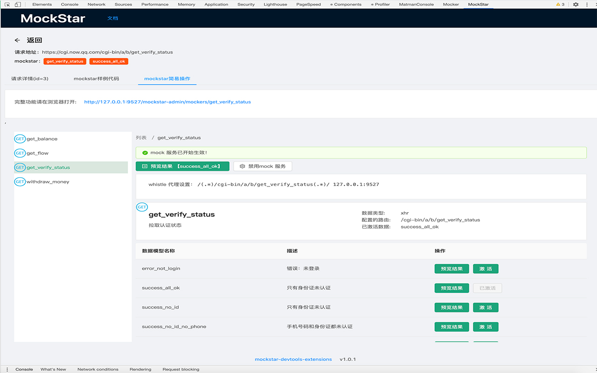

# mockstar-devtools

这是 MockStar Devtools 浏览器扩展的源代码。

## 1. 安装

### 1.1 通过 chrome 应用商店安装

已提交插件，还在审核中。

### 1.2 自助构建和安装

#### 1.2.1 自助构建

> 注意，自助构建不是必须的，你也可以直接下载 `release/MockStar-Chrome-Extensions-vx.x.x.zip` 文件，解压之后可获得`chrome-extensions` 文件夹，可以直接使用，避免手动构建。

将本仓库代码 clone 下来：

``` 
$ git clone https://github.com/mockstarjs/mockstar-devtools-extensions.git
```

安装依赖：

```
$ npm i
```

执行构建：

```
$ npm run build:chrome
```

构建完成之后，构建产物会放置在 `chrome-extensions` 文件夹。

#### 1.2.2 在 Chrome 浏览器上安装扩展

 - 打开 Chrome 浏览器，并在地址栏中输入 `chrome://extensions/`
 - 右上角的"开发者模式"处于"打开"状态
 - 点击"加载已解压的扩展程序"之后，选择上一步产生的 `chrome-extensions` 文件夹
 
 
## 2. 使用

网页加载之后，插件会监听 network ，过滤出 `xhr` 和 `fetch` 类型的请求。



点击列表中的请求之后，会进入到详情页。




## 3. 本地开发

略。

## 4. 其他

- 参考：https://github.com/facebook/react/tree/master/packages/react-devtools-extensions
